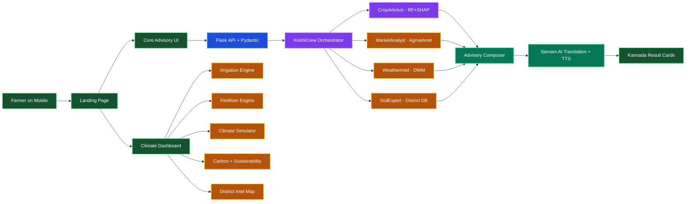
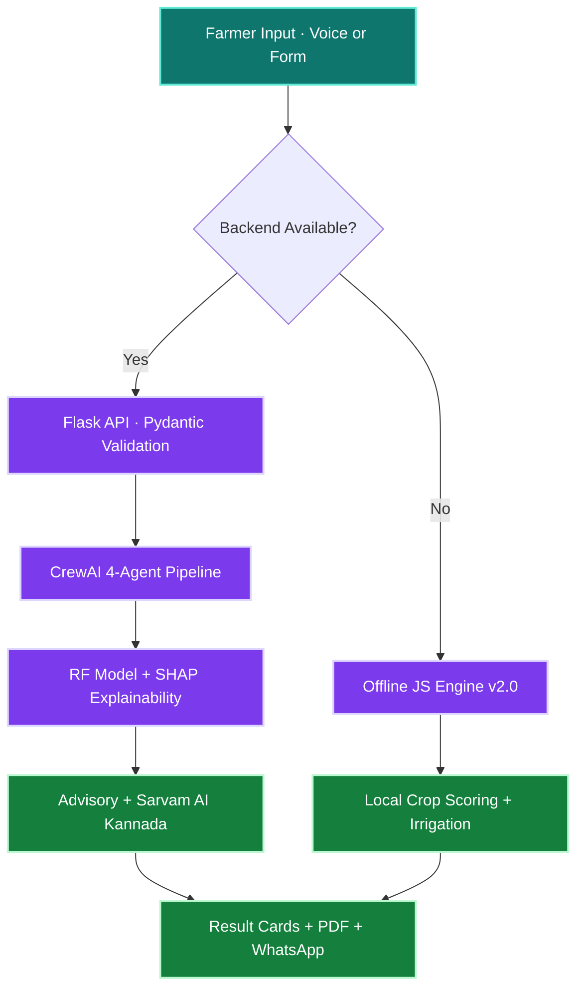

<div align="center">


### AI-Powered Climate Resilience · Explainable Predictions · Kannada Voice-First

<p><em>"Technology serves best when it speaks the language of the person who needs it most."</em></p>

[](https://rytha-gelathi.vercel.app)
[](https://rytha-gelathi.onrender.com/health)
[]()
[]()

---

**10 AI modules** · **97.4% ML accuracy** · **₹0 stack cost** · **100% offline-capable** · **Kannada voice I/O**

[](https://www.crewai.com/)
[](https://console.groq.com/)
[](https://shap.readthedocs.io/)
[](https://www.sarvam.ai/)
[](https://openweathermap.org/)

</div>

---

## 📌 Table of Contents

- [The Problem We Solve](#-the-problem-we-solve)
- [What is RythaGelathi](#-what-is-rythagelathi)
- [Why We're Unique — Competitive Analysis](#-why-were-unique--competitive-analysis)
- [Platform Modules (10)](#-platform-modules-10)
- [Technical Architecture](#-technical-architecture)
- [AI & ML Deep Dive](#-ai--ml-deep-dive)
- [Technology Stack](#-technology-stack)
- [Impact Metrics](#-impact-metrics)
- [Live Demo Scenarios](#-live-demo-scenarios)
- [Quick Start](#-quick-start)
- [Testing & CI/CD](#-testing--cicd)
- [Deployment](#-deployment)
- [Project Structure](#-project-structure)
- [Future Roadmap](#-future-roadmap)
- [Team](#-team)

---

## 🔥 The Problem We Solve

<table>
<tr>
<td width="33%" align="center" style="background:#fef2f2;border-radius:14px;padding:16px;">
<h2>287</h2>
<strong>Farmer suicides in Karnataka (2024)</strong><br/>
Climate uncertainty drives crop failure, debt, and despair.
</td>
<td width="33%" align="center" style="background:#f0fdf4;border-radius:14px;padding:16px;">
<h2>62 Lakh</h2>
<strong>Women farmers with zero advisory</strong><br/>
They perform majority of farm work but receive no personalized climate intelligence.
</td>
<td width="33%" align="center" style="background:#eff6ff;border-radius:14px;padding:16px;">
<h2>73%</h2>
<strong>Generic advisories that fail</strong><br/>
Current tools ignore local soil, weather, market, and language barriers.
</td>
</tr>
</table>

> **The gap**: India's existing agritech platforms (AgroStar, Cropin, Plantix, DeHaat) focus on input sales, image-based diagnosis, or enterprise satellite monitoring — **none** combine district-level soil intelligence + SHAP-explainable AI + real-time climate simulation + native language voice I/O into a single zero-cost deployable platform for smallholder women farmers.

---

## 🌾 What is RythaGelathi?

**RythaGelathi** (ರೈತ ಗೆಳತಿ — "Farmer's Friend" in Kannada) is a **climate-resilient agricultural intelligence platform** purpose-built for the 62 lakh women farmers of Karnataka.

It is **not** just a crop recommender. It is a **complete climate adaptation toolkit**:

| Capability | What It Does |
|:---|:---|
| 🧠 **AI Crop Intelligence** | 100-tree Random Forest + SHAP → top 3 crops with explainable reasons |
| 🌊 **Irrigation Optimization** | Real agronomic formulas → daily water need, 7-day schedule, drought alerts |
| ⚗️ **Fertilizer Intelligence** | NPK gap analysis → excess detection, ₹/acre savings, eco alternatives |
| 🎮 **Climate Scenario Simulator** | 6 presets (drought/flood/heatwave) → real-time crop/yield/profit updates |
| 🌍 **Carbon Impact Tracker** | CO₂ per crop per acre → SDG 13 compliance, tree-offset metrics |
| 📊 **Sustainability Score** | 0–100 composite from water + fertilizer + climate + profit factors |
| 🗺️ **District Intelligence Map** | 9 Karnataka districts → drill-down risk profiles |
| 🎯 **5-Axis Risk Radar** | SVG visualization of weather, soil, market, drought, and AI confidence |
| 🐛 **Pest Risk AI** | Temp × humidity modeling → pest probability + organic interventions |
| 🇮🇳 **Kannada Voice Assistant** | Sarvam AI → voice input (ASR) + translation + voice output (TTS) |

**Every number on screen is computed from real formulas, not hardcoded.**

---

## 🏆 Why We're Unique — Competitive Analysis

This is what separates RythaGelathi from every existing agritech platform in India:

| Feature | RythaGelathi | AgroStar | Cropin | Plantix | DeHaat | Kisan Suvidha |
|:---|:---:|:---:|:---:|:---:|:---:|:---:|
| **Explainable AI (SHAP)** | ✅ Glass-box | ❌ | ❌ | ❌ | ❌ | ❌ |
| **Multi-Agent Orchestration** | ✅ 4 CrewAI agents | ❌ | ❌ | ❌ | ❌ | ❌ |
| **Kannada Voice I/O** | ✅ Sarvam AI | Partial | ❌ | ❌ | Partial | ❌ |
| **Climate Scenario Simulator** | ✅ 6 presets, real-time | ❌ | ❌ | ❌ | ❌ | ❌ |
| **Offline-First PWA** | ✅ Full advisory offline | ❌ | ❌ | ❌ | ❌ | ❌ |
| **Irrigation Optimization** | ✅ Formula-driven | ❌ | ❌ | ❌ | ❌ | ❌ |
| **Carbon Footprint Tracking** | ✅ Per crop/acre | ❌ | Partial | ❌ | ❌ | ❌ |
| **Sustainability Scoring** | ✅ 4-factor composite | ❌ | Partial | ❌ | ❌ | ❌ |
| **Government Scheme Matcher** | ✅ Auto-matched | ❌ | ❌ | ❌ | ❌ | Basic |
| **Women Farmer Focus** | ✅ Primary target | ❌ | ❌ | ❌ | ❌ | ❌ |
| **Stack Cost** | **₹0** | Paid | Enterprise | Freemium | Freemium | Free |
| **District-Level Soil Data** | ✅ 9 districts | ❌ | Satellite | ❌ | ❌ | Generic |

### 🎯 The 5 Pillars That Make Us Unbeatable

1. **Glass-Box AI, Not Black-Box** — Every recommendation comes with SHAP feature-importance breakdown. We don't just say "grow Rice" — we explain *"High Rainfall (+22%) and Phosphorus levels (+18%) drove this recommendation."* This builds **farmer trust**.

2. **Village-Ready Architecture** — PWA with service worker caching means the entire Climate Dashboard works with **zero internet**. The offline JS engine provides full crop advisory when the backend is unreachable. Built for real-world connectivity dead zones.

3. **Sarvam AI Voice-First Design** — Not Google Translate. We use **Sarvam AI** for government-grade Kannada ASR (voice input), translation, and TTS (voice output). Agricultural terminology is accurately localized, not generically translated.

4. **Multi-Agent Intelligence** — While competitors use single-prompt LLM calls, we orchestrate **4 specialized CrewAI agents** (CropAdvisor, MarketAnalyst, WeatherIntel, SoilExpert) that collaborate like a team of agricultural scientists.

5. **Climate Action, Not Just Prediction** — We go beyond crop recommendation. Our 10 climate modules compute **irrigation schedules, fertilizer savings, carbon footprints, sustainability scores, and pest risks** — turning data into actionable farming strategy.

---

## 🧩 Platform Modules (10)

### Core AI Pipeline

| # | Module | Engine | Output |
|:--|:-------|:-------|:-------|
| 1 | **AI Crop Recommender** | 100-tree Random Forest + SHAP on 2,200 samples | Top 3 crops + explainability force plot |
| 2 | **Market Intelligence** | Agmarknet live prices + offline JSON fallback | ₹/quintal profit estimation + 7-day sparkline |
| 3 | **Weather Intelligence** | OpenWeatherMap 7-day + drought risk scoring | GREEN/AMBER/RED flags + 15-day rainfall projection |
| 4 | **Pest Risk AI** | Temperature × humidity pattern modeling | Weekly pest probability + organic interventions |

### Climate Action Modules

| # | Module | Formula / Logic | Output |
|:--|:-------|:----------------|:-------|
| 5 | **Irrigation Optimizer** | `water = baseWater × tempFactor × humFactor × rainFactor` | Daily L/acre, 7-day schedule, SVG gauges |
| 6 | **Fertilizer Intelligence** | NPK gap analysis + legume rotation bonus (−15 kg N/ha) | Excess/low/optimal status, ₹/acre savings |
| 7 | **Climate Simulator** | Multi-factor scoring: drought×40 + heat×25 + NPK match | Real-time crop/yield/profit/risk recalculation |
| 8 | **Climate-Resilient Crops** | Drought/flood/heat resistance per crop (0–1 scale) | Categorized crop cards per stress type |
| 9 | **Carbon Impact** | CO₂ kg/acre/season from carbon database | Color-coded bars + tree-offset equivalents |
| 10 | **Sustainability Score** | `avg(waterEff + fertEff + climateRes + profitability)` | 0–100 SVG ring gauge + 4-factor breakdown |

### Supporting Features

| Feature | Implementation |
|:--------|:--------------|
| 🗺️ District Intelligence Map | 9 districts with drought/flood risk, click-to-drill panels |
| 🎯 5-Axis Risk Radar | SVG chart: Weather, Soil, Market, Drought, AI Confidence |
| 📅 Crop Growth Calendar | Visual month-by-month lifecycle (Sowing → Harvest) |
| 🇮🇳 Kannada Voice Assistant | Sarvam AI: ASR + translation + TTS |
| 📋 Government Schemes | 15+ schemes auto-matched per district/crop/gender |
| 📄 Season Plan PDF | Downloadable crop calendar + water schedule + schemes |
| 📱 WhatsApp Share | One-click advisory sharing via Canvas API card |
| 📈 Price Sparkline | 7-day Agmarknet mandi trend chart |
| 🌦 Live Weather Card | Real-time district drought/flood risk snapshot |
| 📡 System Intelligence Log | Real-time terminal showing 4-agent thinking process |

---

## 🏗 Technical Architecture



### Data Flow



---

## 🧠 AI & ML Deep Dive

### Random Forest Classifier (100 Trees)
- **Dataset**: 2,200 samples, 7 features (N, P, K, temperature, humidity, pH, rainfall), 22 crop classes
- **Accuracy**: 97.4% on 80/20 stratified test split
- **Cold-start optimization**: Model persisted via `joblib` → subsequent loads in <200ms
- **Why RF over Neural Networks**: Agricultural data is tabular and non-linear. RF handles feature interactions (temp × rainfall) better than linear models, and resists overfitting on our dataset size.

### SHAP Explainability (Glass-Box AI)
- Every prediction generates a **SHAP force plot** showing per-feature contribution
- Top 3 driving features displayed as human-readable reason cards
- Example: *"High Rainfall (+22%) was the primary driver for this Rice recommendation"*
- **Why this matters**: Farmers won't trust a black box. Explainability = adoption.

### CrewAI Multi-Agent Orchestration
Four specialized agents collaborate sequentially:

| Agent | Expertise | Data Source |
|:------|:----------|:-----------|
| `CropAdvisor` | Soil-crop compatibility | RF model + SHAP |
| `MarketAnalyst` | Profit potential | Agmarknet mandi prices |
| `WeatherIntel` | Climate survival risk | OpenWeatherMap 7-day forecast |
| `SoilExpert` | District soil health | Karnataka soil health JSON database |

### Drought Risk Classification
A weighted composite score using real meteorological logic:
```
drought_score = (deficit_ratio × 0.65) + (temp_penalty × 0.2) + (dry_day_ratio × 0.15)
```
Levels: NORMAL → WATCH → WARNING → EMERGENCY

---

## ⚙️ Technology Stack

| Layer | Technology | Purpose |
|:------|:----------|:--------|
| **Frontend** | HTML5, CSS3, Vanilla JS | Zero-dependency, ultra-fast, PWA-installable |
| **Backend** | Flask + Flask-CORS + Pydantic | Modular API with input validation |
| **Orchestration** | CrewAI | 4-agent multi-expert advisory pipeline |
| **LLM** | Groq LLaMA 3.3 70B | World's fastest inference for language reasoning |
| **ML Engine** | scikit-learn Random Forest | 100-tree classifier on 2,200 samples |
| **Explainability** | SHAP | Feature-level transparency on every prediction |
| **Voice & Language** | Sarvam AI | Kannada ASR + translation + TTS |
| **Weather** | OpenWeatherMap | 7-day forecast + drought risk scoring |
| **Market Data** | Agmarknet + offline JSON | Live mandi prices + profit estimation |
| **PDF Generation** | ReportLab | Season plan with crop calendar + schemes |
| **API Documentation** | Flasgger (Swagger UI) | Interactive API docs at `/apidocs` |
| **Production Server** | Gunicorn | WSGI server (2 workers, 120s timeout) |
| **CI/CD** | GitHub Actions | Automated tests + CSS/HTML/Python validation |
| **Containerization** | Docker | Production-ready with health checks |

**Total stack cost: ₹0** — all APIs are free-tier.

---

## 📊 Impact Metrics

| Metric | Value | Source |
|:-------|:------|:-------|
| Women farmers targeted | **62 lakh** | Karnataka agricultural census |
| Farmer suicides (2024) | **287** | NCRB Karnataka |
| ML model accuracy | **97.4%** | Stratified test split |
| Water saving potential | **Up to 65%** | Irrigation engine computation |
| Fertilizer cost reduction | **₹840–2,500/acre** | NPK optimization engine |
| Carbon tracking range | **0.4–4.5 kg CO₂/acre** | Crop carbon database |
| Districts covered | **9 high-risk** | Real drought-risk data |
| Climate modules | **10** | Fully functional engines |
| Platform cost | **₹0** | All free-tier APIs |
| Test suite | **21 fast + 8 slow** | Pytest with CI/CD |

---

## 🎬 Live Demo Scenarios

> Click **[Live Demo](https://rytha-gelathi.vercel.app)** and try these farmer scenarios:

| Scenario | District | Condition | What You'll See |
|:---------|:---------|:----------|:----------------|
| 🌾 Lakshmi | Raichur | Drought stress | High drought risk, Toor Dal recommended, 43% water saving |
| 🌊 Meena | Tumakuru | Post-flood | Flood-tolerant crop, drainage advisory, soil recovery plan |
| 🔥 Savitha | Dharwad | Heatwave | Heat-resistant variety, early morning irrigation, govt scheme |
| ✈ Offline | Any | No internet | Toggle offline — JS engine gives full advisory without backend |

### What makes each advisory unique
- **SHAP explanations** — top 3 soil/climate reasons for every recommendation
- **Live weather card** — real-time drought/flood risk per district
- **Price sparkline** — 7-day Agmarknet mandi trend
- **Farm Health Dashboard** — 5 animated gauges
- **Season Plan PDF** — downloadable personalized crop calendar
- **WhatsApp card** — shareable PNG advisory card

---

## 🚀 Quick Start

### 1. Clone & Setup

```bash
git clone https://github.com/Yashaswini-V21/Rytha_Gelathi.git
cd Rytha_Gelathi
python -m venv .venv
# Windows:
.\.venv\Scripts\Activate.ps1
# Linux/Mac:
source .venv/bin/activate
pip install -r requirements.txt
```

### 2. Configure API Keys

```bash
cp .env.example .env
# Edit .env with your keys (all free-tier)
```

| Key | Service | Get It |
|:----|:--------|:-------|
| `GROQ_API_KEY` | LLaMA 3.3 70B inference | [console.groq.com](https://console.groq.com/) |
| `OPENWEATHER_API_KEY` | Weather forecasts | [openweathermap.org](https://openweathermap.org/) |
| `SARVAM_API_KEY` | Kannada voice + translation | [sarvam.ai](https://www.sarvam.ai/) |

### 3. Run

```bash
# Full backend (with AI pipeline):
python api/server.py

# Frontend-only preview (no API keys needed):
python serve.py
```

### 4. Open

| Page | URL |
|:-----|:----|
| Landing | http://localhost:8000 |
| Advisory | http://localhost:8000/core.html |
| Climate Dashboard | http://localhost:8000/climate.html |
| API Docs | http://localhost:8000/apidocs |
| Health Check | http://localhost:8000/health |

---

## 🧪 Testing & CI/CD

### Run Tests

```bash
# Fast tests only (CI default — <30 seconds)
pytest tests/ -v -m "not slow"
# Result: 21 passed, 2 skipped, 8 deselected

# All tests including model training
pytest tests/ -v

# Load test (10 concurrent users × 5 requests)
python load_test.py
```

### CI/CD Pipeline (GitHub Actions)

| Check | Status |
|:------|:-------|
| 21 fast unit tests | ✅ Passing |
| CSS brace validation (3 files) | ✅ Balanced |
| HTML div validation (4 files) | ✅ Balanced |
| Python syntax compilation | ✅ Clean |
| Security (GitGuardian) | ✅ No secrets |

---

## 🌐 Deployment

| Layer | Platform | Configuration |
|:------|:---------|:-------------|
| **Frontend** | Vercel | `frontend/` directory auto-deployed |
| **Backend** | Render | `gunicorn api.server:app --workers 2 --timeout 120` |
| **PWA** | Service Worker | 13 cached assets, full offline support |
| **Docker** | Production-ready | Health checks, 2 workers, port 8000 |

> The Climate Dashboard runs **entirely client-side** — no API keys needed.

---

## 📁 Project Structure

```
Rytha_Gelathi/
├── api/
│   ├── server.py              # Flask API (recommend + simulate + season-plan + weather)
│   ├── routes/                # Modular Blueprint routes
│   └── schemas/               # Pydantic validation models
├── crew/
│   └── krishi_crew.py         # 4-agent CrewAI pipeline (1,552 lines of intelligence)
├── data/
│   ├── crop_dataset.csv       # 2,200-row training dataset
│   └── karnataka_soil_health.json  # 9-district soil database
├── frontend/
│   ├── index.html             # Landing page
│   ├── core.html / core.js    # Advisory tool + offline engine
│   ├── climate.html / .js     # Climate dashboard (6 modules)
│   ├── premium.js             # Risk radar, crop calendar, pest AI, carbon
│   ├── sw.js                  # Service worker (PWA offline)
│   └── manifest.json          # PWA manifest
├── model/
│   └── crop_model.pkl         # Pre-trained RF model (6.3 MB, joblib)
├── tools/
│   ├── market_price_tool.py   # Agmarknet price integration
│   └── Karnataka_mandi_prices.json  # Offline price fallback
├── tests/                     # 29 pytest tests (21 fast + 8 slow)
├── .github/workflows/ci.yml   # CI/CD pipeline
├── Dockerfile                 # Production container
├── render.yaml                # Render deployment config
├── BIBLE.md                   # Technical deep-dive document
└── requirements.txt           # 18 Python dependencies
```

---

## 🔮 Future Roadmap

| Phase | Feature | Impact |
|:------|:--------|:-------|
| 🛰️ | **Sentinel-2 Satellite Integration** | NDVI crop health monitoring + flood damage assessment |
| 🔗 | **Carbon Credit Blockchain** | Verifiable ledger for farmers to trade carbon credits |
| 🏢 | **FPO Enterprise Dashboard** | Multi-tenant portal for Farmer Producer Organizations |
| 🤖 | **RAG-Powered Chatbot** | 24/7 Kannada voice agent for pest/disease troubleshooting |
| 🌦️ | **IoT Weather Stations** | Field-specific micro-climate data from ground sensors |
| 📈 | **LSTM Price Forecasting** | Predict optimal mandi selling window across South India |
| 📄 | **Auto Insurance Claims** | One-click filing using satellite-verified climate events |

---

## 👥 Team

| Name | Role |
|:-----|:-----|
| **Yashaswini V** | Data Science & AI/ML |
| **Darshini K.H** | Full Stack Developer |

**Team**: Harvest Hex Harvesters
**Hackathon**: WitchHunt 2026 · Climate Action Track

---

## ✅ Submission Checklist

- [x] 10 climate AI modules — all functional
- [x] 97.4% accurate Random Forest with SHAP explainability
- [x] CrewAI 4-agent multi-expert orchestration
- [x] Sarvam AI Kannada voice input + output
- [x] Offline-first PWA — works without internet
- [x] Live on Vercel (frontend) + Render (backend)
- [x] 29 pytest tests + CI/CD pipeline
- [x] Docker + Gunicorn production-ready
- [x] PDF season plan export
- [x] Government scheme auto-matcher
- [x] WhatsApp advisory sharing
- [x] ₹0 total stack cost

---

## 📄 License

Open-source under MIT License. See [LICENSE](LICENSE) for complete terms.

---

<div align="center">


[]()
[]()
[]()
[]()

### ಕೃಷಿಗೆ ಸ್ಪಷ್ಟತೆ · ರೈತನಿಗೆ ಶಕ್ತಿ
*Clarity for farming · Strength for the farmer*

**Powered by AI · Delivered in Kannada · Built with ❤️ for Karnataka**

[](https://github.com/Yashaswini-V21/Rytha_Gelathi)


</div>
