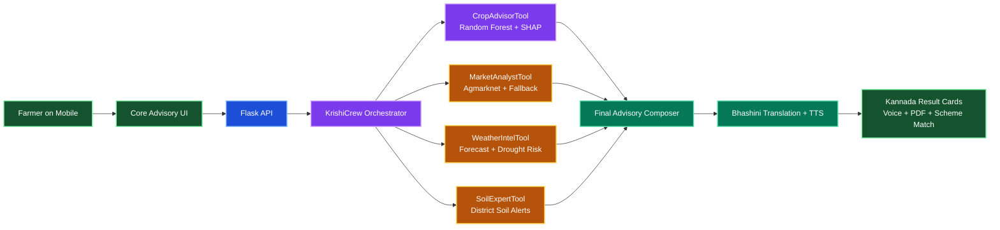
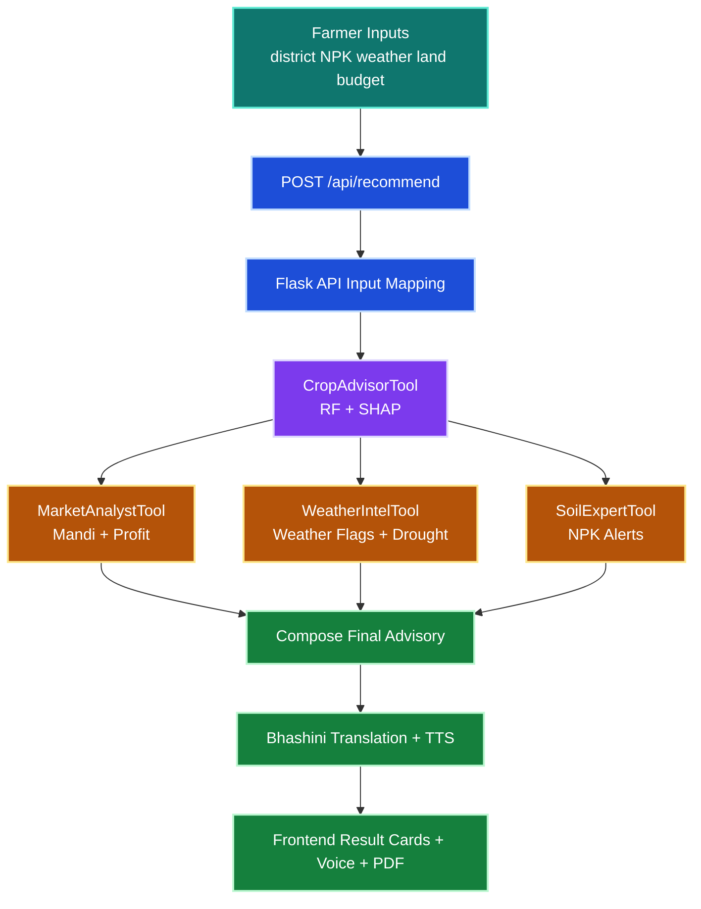

<!-- FARMING STYLE HEADER -->
<div align="center">


<h3>ರೈತ ಗೆಳತಿ · Farmer-first, explainable, Kannada-ready advisory</h3>

<p><strong>One platform for crop, climate, soil, and market intelligence.</strong></p>

<p>
Built for field-level decision making across soil health, forecast risk, mandi prices,
and practical seasonal planning.
</p>

[](https://github.com/Yashaswini-V21/Rytha_Gelathi)
[](.)
[](.)

[](.)
[](.)
[](.)
[](.)

[](https://www.crewai.com/)
[](https://console.groq.com/)
[](https://shap.readthedocs.io/)
[](https://bhashini.gov.in/)
[](https://openweathermap.org/)
[](https://agmarknet.gov.in/)
[](.)


</div>

---

## Table of Contents

- [Project Summary](#project-summary)
- [Why This Matters](#why-this-matters)
- [Design Highlights](#design-highlights)
- [At A Glance](#at-a-glance)
- [What The Platform Delivers](#what-the-platform-delivers)
- [System Architecture](#system-architecture)
- [Data Flow Diagram](#data-flow-diagram)
- [How It Works](#how-it-works)
- [Technology Stack](#technology-stack)
- [API Contract](#api-contract)
- [Project Structure](#project-structure)
- [Quick Start](#quick-start)
- [Environment Variables](#environment-variables)
- [Validation and Testing](#validation-and-testing)
- [Roadmap](#roadmap)
- [Team](#team)
- [License](#license)

---

## Project Summary

RythaGelathi is an AI crop advisory platform built for women farmers in Karnataka.

It converts practical farm inputs into clear recommendations:

- Top crop recommendation
- Profit estimate from mandi prices
- Weather compatibility and drought risk
- Soil health alerts
- SHAP explainability for trust
- Kannada text and voice output

The workflow supports graceful fallback so the core decision path remains usable even when external APIs are unavailable.

---

## Why This Matters

Farmers often receive one-size-fits-all advisories that do not reflect district climate and soil conditions.

Primary gaps this project addresses:

- Generic recommendations without field context
- Low explainability of model output
- Fragmented tools for weather, market, and soil
- Language accessibility barriers for Kannada users

RythaGelathi brings those layers into one farmer-friendly flow.

## Design Highlights

<table>
  <tr>
    <td style="background:#f0fdf4;border:1px solid #bbf7d0;border-radius:14px;padding:16px;vertical-align:top;">
      <strong>Farmer-first clarity</strong><br/>
      The flow stays short, readable, and practical so the advisory can be understood quickly in the field.
    </td>
    <td style="background:#eff6ff;border:1px solid #bfdbfe;border-radius:14px;padding:16px;vertical-align:top;">
      <strong>Color-coded intelligence</strong><br/>
      Layered Mermaid diagrams, section breaks, and badges make the system easy to explain in a demo.
    </td>
    <td style="background:#fffbeb;border:1px solid #fde68a;border-radius:14px;padding:16px;vertical-align:top;">
      <strong>Trust and action</strong><br/>
      SHAP explanations, mandi prices, drought signals, and Kannada voice turn data into decisions.
    </td>
  </tr>
</table>

---

## At A Glance

| Focus | Value |
|------|-------|
| Primary Users | Women farmers in Karnataka |
| Intelligence Core | Random Forest + SHAP |
| Market Layer | Agmarknet + offline fallback |
| Climate Layer | OpenWeatherMap + drought scoring |
| Language Layer | Bhashini Kannada translation + voice |
| Output Style | Explainable, practical, actionable |

---

## What The Platform Delivers

Core capabilities in the current implementation:

1. Random Forest crop recommendation with model accuracy reporting
2. SHAP reasons for why a crop is selected
3. Mandi price ingestion with fallback support
4. Weather compatibility flags and drought risk scoring
5. Soil nutrient alerts from district-level data
6. Kannada translation and TTS payload via Bhashini

Enhancement modules included:

1. Crop Rotation Memory
2. Live Mandi Price Kannada Voice
3. Soil Health Card PDF
4. Drought Risk Early Warning with crop-switch logic
5. Kannada Voice Input flow (frontend module)
6. Season Profitability Comparison
7. Government Scheme Matcher

---

## System Architecture

The architecture is intentionally layered so the story stays clean on slides, in the demo, and in the README.



### Layer View

| Layer | What It Does | Why It Matters |
|------|---------------|-----------------|
| Experience Layer | Collects inputs and renders results | Simple for farmers to use on mobile |
| API Layer | Validates and routes requests | Keeps the interface clean and controlled |
| Intelligence Layer | Runs ML, market, weather, soil and language tools | Turns raw data into farm advice |
| Output Layer | Shows text, voice, PDF, and scheme guidance | Makes the advice usable in the field |

---

## Data Flow Diagram



---

## How It Works

1. Farmer enters district, NPK, climate values, land size, budget, and optional previous crop.
2. Backend maps payload and executes crew tools in sequence or fallback mode.
3. CropAdvisor predicts top crops and computes SHAP explanations.
4. Market tool fetches mandi prices and calculates profit projections.
5. Weather layer computes compatibility and drought-risk classification.
6. Soil layer flags nutrient deficiencies and supports soil-card PDF generation.
7. Final advisory is translated to Kannada and optionally converted to audio.
8. Frontend renders recommendation cards, tables, and downloadable assets.

---

## Technology Stack

| Layer | Stack | Purpose |
|------|-------|---------|
| Frontend | HTML, CSS, Vanilla JS | Form capture, result rendering, voice UI |
| Backend | Flask, Flask-CORS | API + static hosting |
| Orchestration | CrewAI | Multi-step agent workflow |
| LLM Runtime | Groq LLaMA 3.3 70B | Language reasoning and advisory framing |
| ML | scikit-learn Random Forest | Crop prediction |
| Explainability | SHAP | Feature-level decision transparency |
| Weather Data | OpenWeatherMap | Forecast and risk context |
| Market Data | Agmarknet + fallback JSON | Price and profitability |
| Translation and Voice | Bhashini | Kannada translation and TTS |
| Utility | numpy, pandas, requests, dotenv | Data and integration helpers |
| PDF | reportlab | Soil health card generation |

---

## API Contract

### Endpoint

POST /api/recommend

### Request Example

```json
{
  "district": "Raichur",
  "land_acres": 2,
  "temperature": 31,
  "humidity": 62,
  "rainfall": 92,
  "ph": 6.7,
  "N": 82,
  "P": 42,
  "K": 38,
  "input_costs": 18000,
  "last_crop": "Ragi",
  "gender": "female"
}
```

### Response Highlights

```json
{
  "ok": true,
  "result": {
    "top_crop": "Ragi",
    "profit_estimate": 36000,
    "weather_flag": "AMBER",
    "drought_risk": {
      "level": "WATCH",
      "switch_recommended": false
    },
    "profitability_comparison": [],
    "government_schemes": [],
    "soil_alerts": [],
    "shap_reasons": [],
    "kannada_summary": "...",
    "crop_rotation": {},
    "soil_health_pdf_available": false,
    "mandi_price_voice_available": false,
    "details": {}
  }
}
```

### Other Endpoints

- GET /
- GET /health
- GET /public/<path>

---

## Project Structure

```text
Rytha_Gelathi/
├── api/
│   └── server.py
├── crew/
│   └── krishi_crew.py
├── frontend/
│   ├── index.html
│   ├── core.html
│   ├── styles.css
│   ├── core.css
│   ├── app.js
│   └── core.js
├── tools/
│   ├── market_price_tool.py
│   └── Karnataka_mandi_prices.json
├── public/
├── run_demo.py
├── verify_enhancements.py
├── requirements.txt
├── PROJECT_PLAN.md
├── ENHANCEMENTS_SUMMARY.md
└── README.md
```

---

## Quick Start

### 1) Clone

```bash
git clone https://github.com/Yashaswini-V21/Rytha_Gelathi.git
cd Rytha_Gelathi
```

### 2) Create Environment

Windows PowerShell:

```powershell
python -m venv .venv
.\.venv\Scripts\Activate.ps1
```

macOS/Linux:

```bash
python -m venv .venv
source .venv/bin/activate
```

### 3) Install Dependencies

```bash
pip install -r requirements.txt
```

### 4) Configure Keys

Windows:

```powershell
Copy-Item .env.example .env
```

macOS/Linux:

```bash
cp .env.example .env
```

### 5) Run API

```bash
python api/server.py
```

Open:

- Landing: http://127.0.0.1:8000
- Advisory: http://127.0.0.1:8000/core.html
- Health: http://127.0.0.1:8000/health

---

## Environment Variables

Required:

- GROQ_API_KEY
- OPENWEATHER_API_KEY
- BHASHINI_API_KEY

Optional:

- AGMARKNET_API_KEY
- AGMARKNET_API_URL
- AGMARKNET_API_TOKEN
- AGMARKNET_AUTH_HEADER
- AGMARKNET_STATIC_PATH
- CROP_DATASET_PATH
- KARNATAKA_SOIL_JSON_PATH
- API_HOST
- API_PORT

---

## Validation and Testing

Primary checks:

- python -m py_compile crew/krishi_crew.py api/server.py
- python verify_enhancements.py

Notes:

- Python 3.10 to 3.12 is recommended for strongest ecosystem compatibility.
- External API availability and key configuration affect live behavior.

---

## Roadmap

1. Add persistent farmer profile and recommendation history
2. Improve STT production path with secure backend relay
3. Add integration tests for API response schema
4. Add district-level analytics and monitoring dashboard

---

## Future Enhancements

Six next-step upgrades that would make the platform even stronger:

1. Add farmer profile memory so each advisory learns from past seasons and saved soil history.
2. Add district-level historical weather datasets to improve drought prediction beyond forecast-only signals.
3. Add multilingual voice support beyond Kannada so more regional users can use the same flow.
4. Add offline cached advisory packs for low-connectivity villages and repeated farm visits.
5. Add photo-based crop stress detection for leaf and disease symptoms using lightweight vision models.
6. Add a district dashboard for extension officers to monitor crop patterns, alerts, and scheme uptake.

---

## Team

- Yashaswini V - Data Science and AI/ML
- Darshini K.H - Full Stack Developer

Team: harvest hex harvesters

---

## License

Open-source under MIT License.
See LICENSE for complete terms.

---

<!-- FARMING STYLE FOOTER -->
<div align="center">


[](.)
[](.)
[](.)
[](.)

### If this project helped you, please star the repository

[](https://github.com/Yashaswini-V21/Rytha_Gelathi)

Built with care for women farmers in Karnataka.

ಕೃಷಿಗೆ ಸ್ಪಷ್ಟತೆ · ರೈತನಿಗೆ ಶಕ್ತಿ

<p><strong>From uncertainty to confident sowing decisions.</strong></p>


</div>
