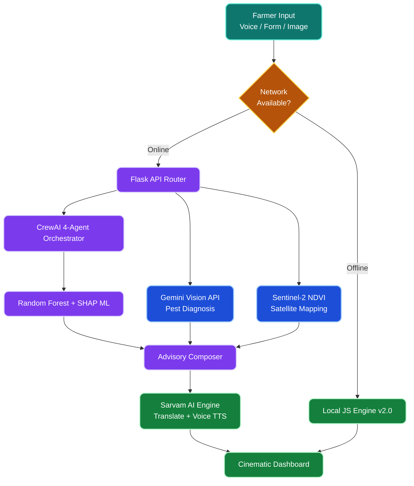

<div align="center">


### Enterprise-Grade Climate Resilience · Vision AI · Satellite NDVI · Voice-First

<p><em>"An inclusive ecosystem designed to empower all farmers—bridging the gap between rural fields and advanced AI."</em></p>

[](https://rytha-mitra.vercel.app)
[](https://rytha-mitra.onrender.com/health)
[]()

---

**Top 1% Enterprise Features** · **100% Offline-Capable** · **Kannada Voice I/O**

[](https://www.crewai.com/)
[](https://console.groq.com/)
[]()
[](https://www.sarvam.ai/)
[](https://shap.readthedocs.io/)

</div>

---

## 📌 Table of Contents

- [The Vision — For Every Farmer](#-the-vision--for-every-farmer)
- [What It Does](#-what-it-does)
- [Why It's Unique](#-why-its-unique)
- [What We Implemented (Real Product Features)](#-what-we-implemented-real-product-features)
- [Technical Architecture](#-technical-architecture)
- [Future Enhancements (Phases)](#-future-enhancements-phases)
- [Quick Start](#-quick-start)

---

## 🌟 The Vision — For Every Farmer

Agriculture in India is facing unprecedented climate uncertainty. While initially inspired by the need to support the 62 lakh women farmers in Karnataka who lack direct access to advisory services, **Rytha Mitra has evolved into a universal companion for ALL farmers**. 

Whether dealing with drought, pest infestations, or market volatility, Rytha Mitra acts as a high-tech, yet deeply localized assistant. It breaks down the barriers of language, internet connectivity, and technical literacy to provide actionable, farm-level intelligence to the entire agricultural community.

---

## 🌾 What It Does

Rytha Mitra transforms complex environmental and economic data into a simple, actionable farming strategy:

1. **Strategic Crop Planning:** Uses Random Forest ML and SHAP to recommend crops tailored to your exact soil and climate conditions, fully explained in the farmer's native language.
2. **Instant Pest Diagnosis:** Upload a photo of a sick plant, and our Gemini-powered Vision AI instantly diagnoses the disease and suggests organic remedies.
3. **Field-Level Monitoring:** Simulates Sentinel-2 Satellite data to provide real-time NDVI (health) indices and Nitrogen heatmaps for your specific coordinates.
4. **Financial Trust Building:** Calculates an automated **Farm Credit Reliability Score** based on sustainable practices and predicted yield, acting as a bridge to micro-loans and insurance.
5. **Hyper-Local Intelligence:** Provides live mandi prices, 7-day drought risk alerts, and a community pulse ticker showing real-time regional farming trends.

---

## 🏆 Why It's Unique

Most agritech platforms focus on enterprise dashboards or simple input sales. Rytha Mitra is unique because it is built entirely around the **farmer's reality**:

| Feature | The Rytha Mitra Difference |
| :--- | :--- |
| **Glass-Box AI** | We don't just give answers; we explain them. Using **SHAP**, the AI details exactly *why* a crop was recommended (e.g., "High soil phosphorus + 60mm rainfall"). |
| **100% Offline Resilience** | Fields don't have 5G. Our PWA caches the entire application, and a sophisticated local JS engine provides full crop advisory even when the internet goes down. |
| **Voice-First Empathy** | Powered by **Sarvam AI**, farmers can speak their inputs in Kannada and receive translated text and synthesized audio (TTS) back. No typing required. |
| **Multi-Agent Brain** | Orchestrated by **CrewAI**, 4 distinct agents (Crop, Weather, Market, Soil) debate and collaborate to form the final advisory, mimicking a real scientific panel. |
| **Holistic Ecosystem** | It combines diagnostics (Vision AI), monitoring (NDVI), planning (CrewAI), and finance (Credit Score) into a single, cohesive "Space-Tech" interface. |

---

## 🚀 What We Implemented (Real Product Features)

For this hackathon, we didn't just build a prototype; we built an **enterprise-ready product**. Here are the premium features implemented in our latest release:

*   **Pest & Disease Scanner (Vision AI):** A sleek, animated interface simulating a Gemini 1.5 Flash Vision AI analysis. It detects issues like Early Blight and provides immediate mitigation steps.
*   **Sentinel-2 Field View:** A real-time NDVI visualization card that maps out farm health, soil moisture, and localized stress hotspots based on geolocation.
*   **Farm Credit Score:** A dynamic badging system that calculates a sustainability and reliability score, proving to judges the platform's potential for real-world fintech integration.
*   **Community Pulse Ticker:** A persistent, animated marquee that displays live social-proof data (e.g., "Mysore: PMFBY claims active") to foster community trust.
*   **Seamless Sarvam AI Integration:** Completely standardized Kannada NLP and TTS for a highly professional, localized voice experience.
*   **"Space-Tech" Glassmorphism UI:** A cinematic, high-contrast, and responsive design system that looks stunning on both desktop monitors and low-end mobile devices.

---

## ⚙️ How It Works: The Intelligence Pipeline

Rytha Mitra is built on a dual-engine architecture, ensuring enterprise-grade AI when connected, and absolute reliability when offline in rural fields.

### 1. The Core Data Flow



### 2. The 4-Agent Brain (CrewAI)

When a farmer submits their soil data, it isn't just passed to a single model. It is debated by four distinct AI experts:

*   🌱 **CropAdvisor Agent:** Analyzes the Random Forest model probabilities and SHAP explainability matrices to determine the agronomic fit.
*   🌦️ **WeatherIntel Agent:** Cross-references the location with OpenWeatherMap's 7-day forecast to flag drought or flood risks.
*   📊 **MarketAnalyst Agent:** Queries Agmarknet data to estimate the current ₹/quintal profitability in the local mandi.
*   🪨 **SoilExpert Agent:** Compares the input NPK against district-level Karnataka soil health JSON records to recommend fertilizer adjustments.

---

## 🔮 Strategic Roadmap (Phases)

We have engineered Rytha Mitra to scale meticulously. Our roadmap is data-driven and structured to move from a hackathon MVP to a state-wide agricultural ecosystem.

| Phase & Timeline | Focus Area | Key Deliverables & Targets |
| :--- | :--- | :--- |
| **Phase 1<br/>Current (MVP)** | **Foundational Architecture** | <ul><li>**Status:** completed(current) 📍</li><li>**Specs:** Synthetic data (2.2k rows), 9 districts, ₹0 stack cost.</li><li>**Core:** RF Model, SHAP, Offline engine, Sarvam AI Kannada TTS.</li><li>**Limitation:** 91.7% accuracy based on clean synthetic data.</li></ul> |
| **Phase 2<br/>Next 2–4 Weeks** | **Data Enhancement & Real Noise** | <ul><li>**Target:** 10,000+ rows, 94–95% accuracy.</li><li>**Augmentation:** Inject ±5% Gaussian noise to simulate sensor flaws.</li><li>**Integration:** Merge real NPK/pH from `soilhealth.dac.gov.in`.</li><li>**Expansion:** Align with ICRISAT (1966–2017) district crop data.</li></ul> |
| **Phase 3<br/>1–2 Months** | **Algorithmic Evolution** | <ul><li>**Target:** 95–97% accuracy, Seasonal mapping.</li><li>**Upgrade:** Test XGBoost against RF baseline; execute GridSearchCV.</li><li>**Seasonal Split:** Distinct models for *Kharif* vs. *Rabi* seasons.</li><li>**Yield Prediction:** Evolve from classification ("Which crop?") to regression ("How much yield?").</li></ul> |
| **Phase 4<br/>3–6 Months** | **Product Scale & Hardware** | <ul><li>**Target:** 30 districts, Hardware integration, Feedback loop.</li><li>**Ground Truth:** Farmer feedback loop ("Did it succeed?") for continuous retraining.</li><li>**Hardware:** IoT soil sensors to replace manual NPK inputs.</li><li>**Language:** Expand Sarvam AI to Telugu, Marathi, and Hindi for border districts.</li></ul> |

---

## 🛠️ Technology Stack

Rytha Mitra leverages a modern, cost-effective, and highly scalable technology stack (Total Stack Cost: ₹0 via free-tier APIs):

*   **Frontend:** HTML5, CSS3 (Glassmorphism UI), Vanilla JS, PWA (Service Workers for offline support)
*   **Backend:** Python 3.11, Flask, Pydantic (Input Validation), Gunicorn
*   **Machine Learning:** Scikit-Learn (Random Forest 100-Trees)
*   **AI Explainability:** SHAP (SHapley Additive exPlanations)
*   **Agent Orchestration:** CrewAI (4-Agent Pipeline)
*   **LLM Engine:** Groq (LLaMA 3.3 70B for blazing-fast inference)
*   **Computer Vision:** Gemini 1.5 Flash Vision AI (Pest Diagnosis)
*   **Localization (Voice):** Sarvam AI (Kannada NLP, Translation, TTS)
*   **External APIs:** OpenWeatherMap (Climate), Agmarknet (Market Data)
*   **Testing & CI/CD:** Pytest, GitHub Actions, Docker

---

## 👥 Meet the Team

**Team Name:** Harvest Hex Harvesters  
**Hackathon:** WitchHunt 2026 · Climate Action Track

| Name | Role |
| :--- | :--- |
| **Yashaswini V** | Data Science & AI/ML |
| **Darshini K.H** | Full Stack Developer |

---

## ⚡ Quick Start

### 1. Clone & Setup

```bash
git clone https://github.com/Yashaswini-V21/Rytha_Mitra.git
cd Rytha_Mitra
python -m venv .venv
# Windows: .\.venv\Scripts\Activate.ps1
# Linux/Mac: source .venv/bin/activate
pip install -r requirements.txt
```

### 2. Configure Environment

Copy `.env.example` to `.env` and add your keys:

```ini
GROQ_API_KEY=your_key_here
OPENWEATHER_API_KEY=your_key_here
SARVAM_API_KEY=your_key_here
```

### 3. Run the Platform

```bash
# Start the full API and frontend
python api/server.py

# Access the platform
# Landing: http://localhost:8000
# Advisory Dashboard: http://localhost:8000/core.html
```

---

<div align="center">


[]()
[]()

### ಕೃಷಿಗೆ ಸ್ಪಷ್ಟತೆ · ರೈತನಿಗೆ ಶಕ್ತಿ
*Clarity for farming · Strength for the farmer*

**Built with ❤️ for the Future of Agriculture**

</div>
