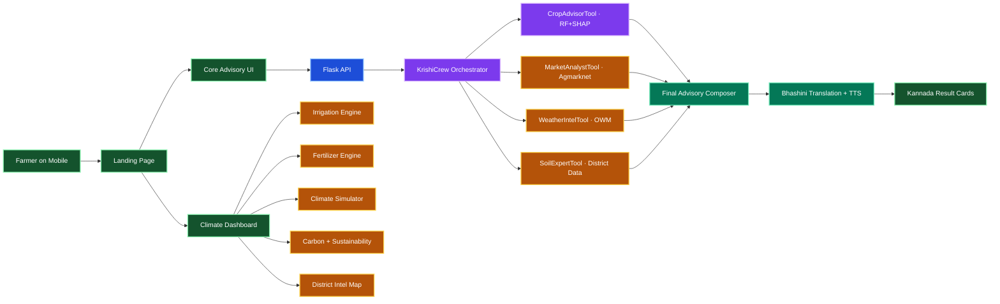
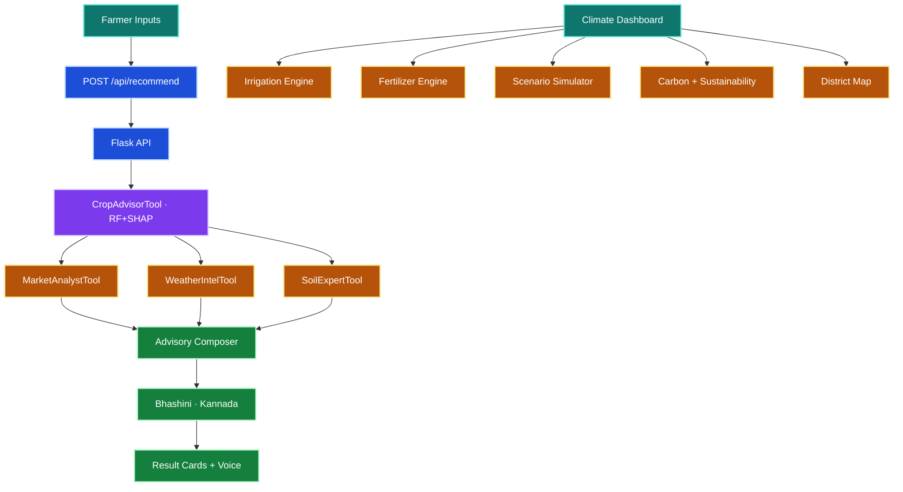

<!-- FARMING STYLE HEADER -->
<div align="center">


<h3>ರೈತ ಗೆಳತಿ · Climate-resilient, explainable, Kannada-ready agricultural intelligence</h3>

<p><strong>10 AI modules for irrigation optimization, fertilizer intelligence, carbon tracking, sustainability scoring, and crop advisory — at ₹0 stack cost.</strong></p>

[](https://github.com/Yashaswini-V21/Rytha_Gelathi)
[](.)
[](.)

[](.)
[](.)
[](.)
[](.)

[](https://www.crewai.com/)
[](https://console.groq.com/)
[](https://shap.readthedocs.io/)
[](https://bhashini.gov.in/)
[](https://openweathermap.org/)
[](https://agmarknet.gov.in/)


</div>

---

## Table of Contents

- [Project Summary](#project-summary)
- [Why This Matters](#why-this-matters)
- [Platform Modules (10)](#platform-modules-10)
- [Impact Metrics](#impact-metrics)
- [System Architecture](#system-architecture)
- [Data Flow Diagram](#data-flow-diagram)
- [Climate Dashboard](#climate-dashboard)
- [Technology Stack](#technology-stack)
- [API Contract](#api-contract)
- [Project Structure](#project-structure)
- [Quick Start](#quick-start)
- [Environment Variables](#environment-variables)
- [Deployment](#deployment)
- [Team](#team)
- [License](#license)

---

## Project Summary

RythaGelathi is a **climate-resilient agriculture platform** built for 62 lakh women farmers in Karnataka.

It is not just a crop recommender — it is a **complete climate adaptation toolkit**:

| What | How |
|------|-----|
| 🌾 **Crop Intelligence** | Random Forest + SHAP explainability → top 3 crops with reasons |
| 🌊 **Irrigation Optimization** | Real agronomic formulas → daily water need, weekly schedule, drought/overwatering alerts |
| ⚗️ **Fertilizer Intelligence** | NPK gap analysis → excess detection, cost savings, eco-friendly alternatives |
| 🎮 **Climate Scenario Simulator** | 6 presets (drought, flood, heatwave) → real-time crop/yield/profit recalculation |
| 🌍 **Carbon Impact Module** | CO₂ per crop per acre → greener farming recommendations |
| 📊 **Sustainability Score** | 0–100 composite → water efficiency + fertilizer + climate resilience + profitability |
| 🗺️ **District Intelligence Map** | 9 Karnataka districts → drought/flood risk, crop suitability, click-to-drill |
| 🇮🇳 **Kannada Output** | Bhashini government API → text translation + text-to-speech |
| 📈 **Market Intelligence** | Agmarknet mandi prices → profit estimation with offline fallback |
| 🐛 **Pest Risk Alerts** | Temperature + humidity patterns → weekly pest probability + organic interventions |

Every number on screen is **computed from real formulas**, not hardcoded.

---

## Why This Matters

<table>
  <tr>
    <td style="background:#fef2f2;border:1px solid #fecaca;border-radius:14px;padding:16px;vertical-align:top;">
      <strong>287</strong><br/>
      Farmer suicides in Karnataka in 2024. Climate uncertainty drives crop failure and debt.
    </td>
    <td style="background:#f0fdf4;border:1px solid #bbf7d0;border-radius:14px;padding:16px;vertical-align:top;">
      <strong>62 Lakh</strong><br/>
      Women perform the majority of farm work but receive zero personalised climate advisory.
    </td>
    <td style="background:#eff6ff;border:1px solid #bfdbfe;border-radius:14px;padding:16px;vertical-align:top;">
      <strong>73%</strong><br/>
      Farmers get generic advisories that ignore local soil, weather, and market conditions.
    </td>
  </tr>
</table>

RythaGelathi solves this by combining **district-specific intelligence** + **real-time climate simulation** + **Kannada accessibility** into one deployable platform at **₹0 stack cost**.

---

## Platform Modules (10)

### Core AI Pipeline

| # | Module | Logic | Output |
|---|--------|-------|--------|
| 1 | **AI Crop Recommender** | 100-tree Random Forest on 2,200-sample dataset | Top 3 crops + SHAP force_plot reasons |
| 2 | **Market Intelligence** | Agmarknet live prices + offline JSON fallback | ₹/quintal profit estimation |
| 3 | **Weather Intelligence** | OWM 7-day forecast + drought risk scoring | GREEN/AMBER/RED compatibility flags |
| 4 | **Pest Risk Alert** | Temperature + humidity pattern modeling | Weekly pest probability + organic advice |

### Climate Action Modules (NEW)

| # | Module | Formula/Logic | Output |
|---|--------|---------------|--------|
| 5 | **Irrigation Optimization** | `water = baseWater × tempFactor × humFactor × rainFactor` | Daily L/acre, 7-day schedule, SVG gauges |
| 6 | **Fertilizer Intelligence** | NPK gap analysis with legume rotation bonus | Excess/low/optimal status, ₹/acre savings |
| 7 | **Climate Scenario Simulator** | Multi-factor scoring: drought×40 + heat×25 + NPK match | Real-time crop/yield/profit/risk updates |
| 8 | **Climate-Resilient Crops** | Drought/flood/heat resistance per crop (0–1 scale) | Categorized crop cards per stress type |
| 9 | **Carbon Impact Module** | CO₂ kg/acre/season per crop from carbon database | Color-coded comparison bars |
| 10 | **Sustainability Score** | `avg(waterEff + fertEff + climateRes + profitability)` | 0–100 SVG ring gauge + 4-factor breakdown |

### Supporting Features

| Feature | Implementation |
|---------|----------------|
| 🗺️ Karnataka District Map | 9 districts with drought/flood risk, click-to-drill detail panels |
| 🇮🇳 Kannada Translation | Bhashini API (government) → text + voice |
| 📋 Government Schemes | Auto-matched based on crop, district, and gender |
| 📱 WhatsApp Share | One-click advisory sharing |

---

## Impact Metrics

| Metric | Value | Source |
|--------|-------|--------|
| Women farmers targeted | 62 lakh | Karnataka agricultural census |
| Farmer suicides (2024) | 287 | NCRB Karnataka |
| Water saving potential | Up to 65% | Irrigation engine computation |
| Fertilizer cost reduction | ₹840–2,500/acre | NPK optimization engine |
| Carbon tracking range | 0.4–4.5 kg CO₂/acre | Crop carbon database |
| Districts covered | 9 high-risk | Real drought-risk data |
| Platform cost | ₹0 | All free-tier APIs |
| Climate modules | 10 | Fully functional engines |

---

## System Architecture



---

## Data Flow Diagram



---

## Climate Dashboard

The Climate Intelligence Dashboard is a **standalone page** (`climate.html`) with 6 interactive modules:

### Simulator
Drag sliders for rainfall, temperature, humidity, soil pH, and NPK — watch crop recommendation, yield estimate, profit projection, irrigation need, sustainability score, and climate risk update **in real time**.

6 one-click presets: ☀️ Normal · 🏜️ Drought · 🌊 Flood · 🔥 Heatwave · 💧 Water Scarcity · ⚗️ Fertilizer Shortage

### Irrigation Engine
- **Input**: District, crop, soil type, land size, rainfall, temperature, humidity
- **Output**: Daily water (L/acre), irrigation frequency, water savings %, 7-day schedule with skip-days, drought/overwatering alerts, low-water crop alternatives
- **Formula**: `dailyWater = baseWater × (1 + max(0, (temp-28)×0.05)) × (1 - hum/300) × max(0.3, 1 - rain/baseWater) / 7`

### Fertilizer Engine
- **Input**: N, P, K (kg/ha), soil pH, crop type, previous crop
- **Output**: Excess/low/optimal status per nutrient, ₹/acre cost of overuse, soil health impact, CO₂ from fertilizer, eco-friendly alternatives (vermicompost, neem-coated urea, green manure, bio-fertilizers)
- **Logic**: Compares current NPK against crop-specific requirements with ±30% tolerance bands. Legume previous crop reduces N requirement by 15 kg/ha.

### Carbon Impact
CO₂ per crop per acre per season — from 0.4 kg (Toor Dal) to 4.5 kg (Sugarcane) — with color-coded comparison bars.

### Sustainability Score
Composite 0–100 score from 4 equally weighted factors:
1. 💧 Water Efficiency
2. ⚗️ Fertilizer Efficiency
3. 🌾 Climate Resilience
4. 💰 Profitability

### District Map
9 Karnataka districts with drought risk, flood risk, average rainfall, average temperature, best crops, and sustainability baseline. Click any district card for a drill-down detail panel.

---

## Technology Stack

| Layer | Stack | Purpose |
|-------|-------|---------|
| Frontend | HTML, CSS, Vanilla JS | 3 pages: Landing, Advisory, Climate Dashboard |
| Backend | Flask, Flask-CORS | API + static hosting |
| Orchestration | CrewAI | 4-agent advisory workflow |
| LLM | Groq LLaMA 3.3 70B | Language reasoning |
| ML | scikit-learn Random Forest | Crop prediction (100 trees, 2,200 samples) |
| Explainability | SHAP | Feature-level transparency |
| Climate Engines | Vanilla JS | Irrigation, fertilizer, carbon, sustainability computation |
| Weather | OpenWeatherMap | Forecast + drought risk |
| Market | Agmarknet + offline JSON | Mandi prices + profit estimation |
| Translation | Bhashini (Govt API) | Kannada text + voice |

**Total stack cost: ₹0** — all APIs are free-tier.

---

## API Contract

### POST /api/recommend

```json
{
  "district": "Raichur",
  "land_acres": 2,
  "temperature": 31,
  "humidity": 62,
  "rainfall": 92,
  "ph": 6.7,
  "N": 82, "P": 42, "K": 38,
  "input_costs": 18000,
  "last_crop": "Ragi",
  "gender": "female"
}
```

### POST /api/simulate
Fast simulation endpoint — bypasses full CrewAI pipeline for real-time slider updates.

### Other Endpoints
- `GET /` — Landing page
- `GET /health` — Health check
- `GET /public/<path>` — Static assets

---

## Project Structure

```text
Rytha_Gelathi/
├── api/
│   └── server.py              # Flask API (recommend + simulate endpoints)
├── crew/
│   └── krishi_crew.py         # 4-agent CrewAI pipeline (61KB)
├── frontend/
│   ├── index.html             # Landing page (splash + features + metrics)
│   ├── core.html              # Core advisory tool
│   ├── climate.html           # Climate Intelligence Dashboard (NEW)
│   ├── styles.css             # Landing + shared styles (52KB)
│   ├── core.css               # Advisory-specific styles
│   ├── climate.css            # Climate dashboard styles (NEW)
│   ├── app.js                 # Landing page logic
│   ├── core.js                # Advisory logic + simulator
│   └── climate.js             # Climate engines (NEW — irrigation, fertilizer, carbon, etc.)
├── tools/
│   ├── market_price_tool.py   # Agmarknet integration
│   └── Karnataka_mandi_prices.json
├── public/                    # Image assets
├── serve.py                   # Dev server with /public/ routing
├── requirements.txt
├── PROJECT_PLAN.md
└── README.md
```

---

## Quick Start

### 1) Clone

```bash
git clone https://github.com/Yashaswini-V21/Rytha_Gelathi.git
cd Rytha_Gelathi
```

### 2) Create Environment

```powershell
python -m venv .venv
.\.venv\Scripts\Activate.ps1
```

### 3) Install Dependencies

```bash
pip install -r requirements.txt
```

### 4) Configure Keys

```powershell
Copy-Item .env.example .env
# Edit .env with your API keys
```

### 5) Run

**Full backend (with AI pipeline):**
```bash
python api/server.py
```

**Frontend-only preview (no API keys needed):**
```bash
python serve.py
```

### 6) Open

| Page | URL |
|------|-----|
| Landing | http://localhost:8000 |
| Advisory | http://localhost:8000/core.html |
| Climate Dashboard | http://localhost:8000/climate.html |
| Health Check | http://localhost:8000/health |

---

## Environment Variables

**Required:**
- `GROQ_API_KEY` — Groq LLaMA 3.3 70B
- `OPENWEATHER_API_KEY` — OpenWeatherMap
- `BHASHINI_API_KEY` — Kannada translation + TTS

**Optional:**
- `AGMARKNET_API_KEY`, `AGMARKNET_API_URL` — Live mandi prices
- `CROP_DATASET_PATH` — Custom crop dataset
- `API_HOST`, `API_PORT` — Server configuration

---

## Deployment

| Service | What | How |
|---------|------|-----|
| **Vercel** | Frontend (3 HTML pages + CSS + JS) | Deploy `frontend/` directory |
| **Render** | Flask API backend | Deploy with `python api/server.py` |

The Climate Dashboard (`climate.html`) runs **entirely client-side** — no API keys needed. Only the Core Advisory requires the Flask backend.

---

## Team

| Name | Role |
|------|------|
| **Yashaswini V** | Data Science & AI/ML |
| **Darshini K.H** | Full Stack Developer |

**Team:** harvest hex harvesters
**Hackathon:** WitchHunt 2026 · Climate Action Track

---

## License

Open-source under MIT License. See LICENSE for complete terms.

---

<!-- FARMING STYLE FOOTER -->
<div align="center">


[](.)
[](.)
[](.)
[](.)

### ಕೃಷಿಗೆ ಸ್ಪಷ್ಟತೆ · ರೈತನಿಗೆ ಶಕ್ತಿ

<p><strong>From climate uncertainty to confident sowing decisions — powered by AI, delivered in Kannada.</strong></p>

[](https://github.com/Yashaswini-V21/Rytha_Gelathi)


</div>
